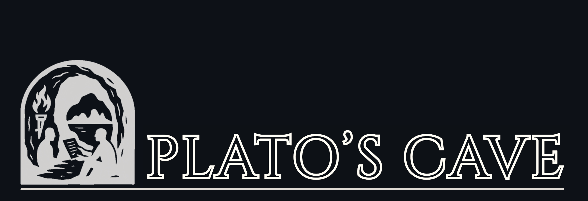

<div align="center">


 *A Human-Centered Agentic System for Validating Research Papers*

[](https://www.hackathonparty.com/hackathons/26/projects/355)
[](LICENSE.md)
[](mailto:mkunzlermaldaner@ufl.edu)


</div>

---

### 📹 Watch the Demo

We developed Plato's Cave as part of the University of Florida's AI Days Hackathon, and therefore had to keep the video within the time limit:

<div align="center">
  <a href="https://www.youtube.com/watch?v=wvmJdUhuj4s" target="_blank">
    
  </a>

  <br><br>

  <a href="https://www.youtube.com/watch?v=wvmJdUhuj4s" target="_blank">
    
  </a>
</div>

---

### 🧠 Overview

Plato’s Cave helps you **comprehend dense academic material** by analyzing PDFs and URLs using progressive AI assistance.  
Like emerging from Plato’s allegorical cave into enlightenment, this tool illuminates the **shadows of academic literature**, uncovering key insights, visualizations, and summaries.  


<div align="center">


</div>

## Quick Start

You have to run the frontend, backend and docker image on **three** separate terminal sessions. Follow the commands below:

### (1) 🪶 Frontend Setup

```bash
cd frontend
npm install
gatsby develop  # If command not found, try: npx gatsby develop
```

If you see
Module not found: Can't resolve 'lucide-react':
```bash
npm install lucide-react
```

This will start the development server at `http://localhost:8000`

### (2) 🖥️ Backend Setup

On a separate terminal, while the frontend is still running, run the following commands:

```bash
# install uv 
# curl -LsSf https://astral.sh/uv/install.sh | sh
cd backend
uv sync
source .venv/bin/activate
uvx playwright install chromium --with-deps
```

Create a .env file
```
touch .env
```

Add your BROWSER_USE_API_KEY to the file (get $10 free [here](https://cloud.browser-use.com/#settings/api-keys/new))<br>
Add your EXA_API_KEY to the file (get $10 free [here](https://dashboard.exa.ai/home))
```
nano .env  # Open the file and add the line below
BROWSER_USE_API_KEY="bu_YOURKEY"
EXA_API_KEY="YOURKEY"
```

```bash
# install VNC server
sudo apt-get install x11vnc

# start VNC server
x11vnc -display :0 -forever -shared

sudo apt update
sudo apt install chromium-browser
google-chrome --remote-debugging-port=9222 --user-data-dir=/tmp/chrome-debug

python server.py
```

### (3) 🐳 Docker Image for Web Agent

Also an "image" here is not to be interpreted as a picture. You can think of a Docker image as a package that has everything you need to run some software (it has the libraries, code, envs, configs...)

```bash 
# start the docker (open Docker Desktop if on Windows -> Resources -> WSL Integration -> Enable Integration)
docker compose -f docker-compose.browser.yaml up --build remote-browser
# alternatively you can run it detached:
# docker compose -f docker-compose.browser.yaml up -d
```


## 🧩 Tech Stack


| Component         | Technology            |
| ----------------- | --------------------- |
| 🖼️ Frontend      | Gatsby.js             |
| 🧠 Backend        | Python (FastAPI)      |
| 🌐 Web Automation | Playwright + Chromium |
| 🤖 AI Integration | Browser-Use API       |
| 🐳 Environment    | Docker                |


<hr style="border: 0.5px solid #e5e5e5; margin: 20px 0;">

## 🔢 Scoring Mathematics Located [Here](https://github.com/matheusmaldaner/PlatosCave/blob/main/graph_app/README.md)

---

## 📜 License

**Copyright © 2025 Matheus Kunzler Maldaner. All Rights Reserved.**

This project is licensed under the **Plato's Cave Research and Academic Use License**.

### 📄 Full License

See [LICENSE.md](./LICENSE.md) for complete terms and conditions.

### 📚 Citation

If you use this software in academic research, please cite:

```bibtex
@software{maldaner2025platoscave,
  author = {Maldaner, Matheus Kunzler and Valle, Raul and Wormald, Stephen and O'Connor, Kristian and Woelke, James},
  title = {Plato's Cave: A Trust-Propagating Knowledge Graph System for Academic Research Verification},
  year = {2025},
  institution = {University of Florida},
  note = {Winner: 1st Place, UF AI Days GatorHack},
  url = {https://github.com/matheusmaldaner/PlatosCave}
}
```
