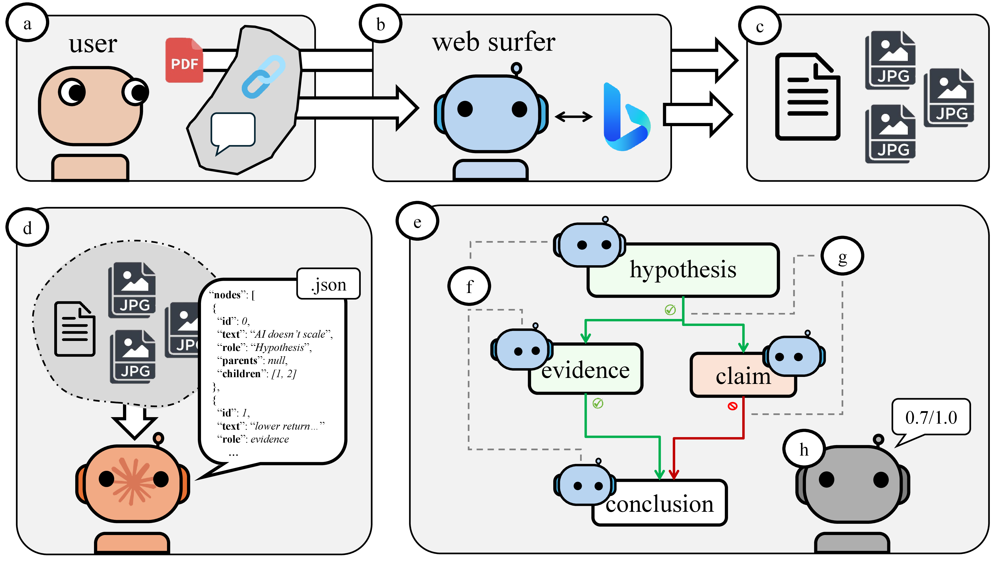
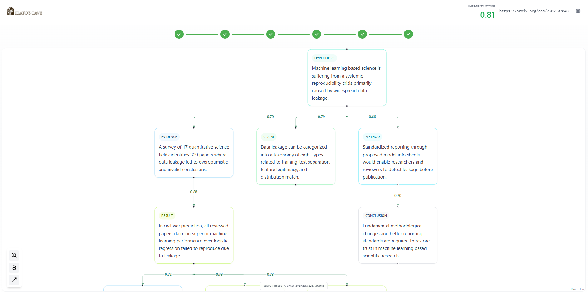
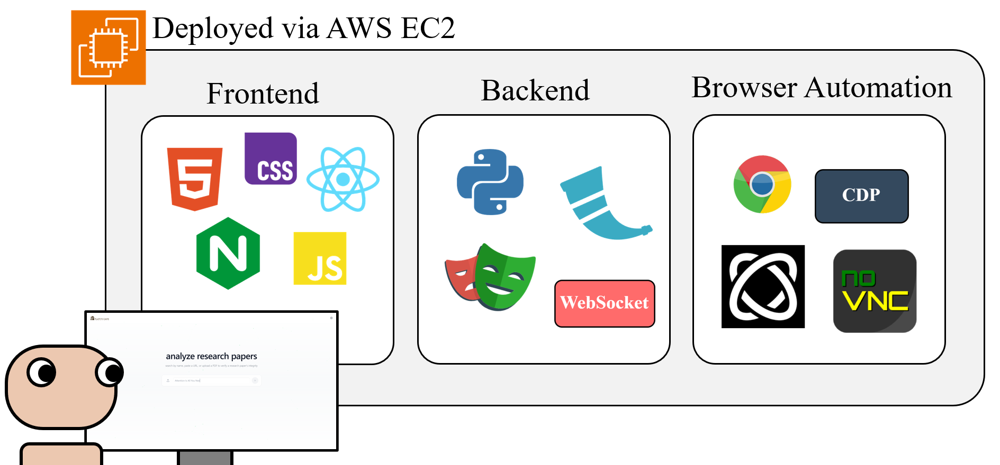

<div align="center">


*A human-centered agentic system for validating research papers*

[](https://www.hackathonparty.com/hackathons/26/projects/355)
[](https://arxiv.org/)


</div>

<div align="center">
  
  <br>
  <sub><b>System Overview.</b> (a) The user provides a PDF, URL, or natural-language query. (b) A web-surfer agent browses for the paper. (c) Text and images are extracted. (d) An LLM converts the content into a role-labeled DAG. (e) The frontend renders an interactive graph. (f) Web agents verify each node using external sources. (g) Trust-gated propagation flows along dependency edges. (h) The scorer aggregates signals into an overall paper-level score.</sub>
</div>


## Overview

Plato's Cave helps you **comprehend dense academic material** by analyzing PDFs and URLs using progressive AI assistance. Like emerging from Plato's allegorical cave into enlightenment, this tool illuminates the shadows of academic literature, uncovering key insights, visualizations, and summaries.

<div align="center">
  
  <br>
  <sub><b>Deployed interface.</b> Plato's Cave showing a finalized run with the visualized DAG and Integrity Score.</sub>
</div>

## How It Works

Plato's Cave runs a multi-stage pipeline to evaluate the integrity of a research paper:

1. **Validate** -- accepts a PDF upload or URL, extracts the full text
2. **Decompose** -- breaks the paper into atomic claims using an LLM
3. **Build Knowledge Graph** -- structures claims as a directed acyclic graph (DAG) with role-aware nodes (Hypothesis, Evidence, Method, Conclusion)
4. **Organize Agents** -- dispatches browser-based AI agents to independently verify each claim against external sources
5. **Compile Evidence** -- aggregates agent findings, scoring each node on six dimensions (credibility, relevance, evidence strength, method rigor, reproducibility, citation support)
6. **Evaluate Integrity** -- propagates trust through the graph using role-aware edge confidences and trust gating, producing a final integrity score

The scoring mathematics are documented in detail [here](https://github.com/matheusmaldaner/PlatosCave/blob/main/graph_app/README.md).

## Architecture

<div align="center">
  
  <br>
  <sub><b>System Architecture.</b> Gatsby.js + React frontend, Python scoring backend, and Docker containers with browser-use verification agents, deployed via AWS EC2.</sub>
</div>

## Getting Started

Try the live deployment at **[platoscave.matheus.wiki](https://platoscave.matheus.wiki/)**, or run it locally:

### Prerequisites

- Node.js and npm
- Python 3.10+
- [uv](https://docs.astral.sh/uv/) (Python package manager)
- Docker
- API keys for [Browser-Use](https://cloud.browser-use.com/#settings/api-keys/new) and [Exa](https://dashboard.exa.ai/home)

### 1. Frontend

```bash
cd frontend
npm install
gatsby develop
```

If `gatsby` is not found, use `npx gatsby develop`. The dev server starts at `http://localhost:8000`.

### 2. Backend

In a separate terminal:

```bash
cd backend
uv sync
source .venv/bin/activate
```

Create a `.env` file in the `backend/` directory with your API keys:

```
BROWSER_USE_API_KEY="bu_YOURKEY"
EXA_API_KEY="YOURKEY"
```

Then start the server:

```bash
python server.py
```

### 3. Remote Browser (Docker)

In a third terminal:

```bash
cd backend
docker compose -f docker-compose.browser.yaml up --build remote-browser
```

Once you have all three separate terminals running, you can access the application at `http://localhost:8000`


<hr style="border: 0.5px solid #e5e5e5; margin: 20px 0;">

## 🔢 Scoring Mathematics Located [Here](https://github.com/matheusmaldaner/PlatosCave/blob/main/graph_app/README.md)

---

## 📜 License

**Copyright © 2025 Matheus Kunzler Maldaner. All Rights Reserved.**

This project is licensed under the **Plato's Cave Research and Academic Use License**.

### 📄 Full License

See [LICENSE.md](./LICENSE.md) for complete terms and conditions.

### 📚 Citation

If you use this software in academic research, please cite:

```bibtex
@article{maldaner2026platoscave,
  author = {Maldaner, Matheus Kunzler and Valle, Raul and Kim, Junsung and Sultan, Tonuka and Bhargava, Pranav and Maloni, Matthew and Courtney, John and Nguyen, Hoang and Sawant, Aamogh and O'Connor, Kristian and Wormald, Stephen and Woodard, Damon L.},
  title = {Plato's Cave: A Human-Centered Research Verification System},
  year = {2026},
  eprint = {2603.23526},
  archivePrefix = {arXiv},
  url = {https://arxiv.org/abs/2603.23526}
}
```
