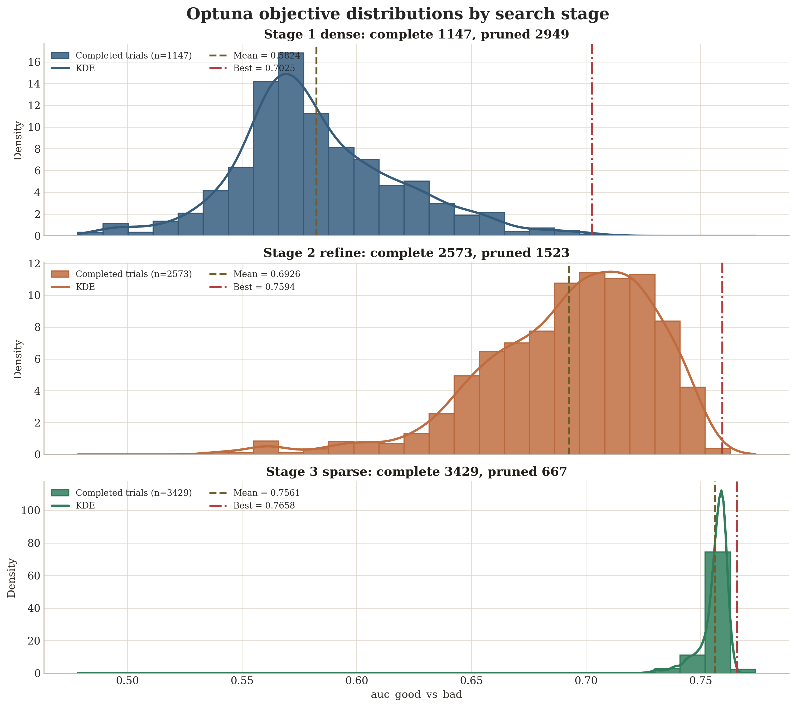
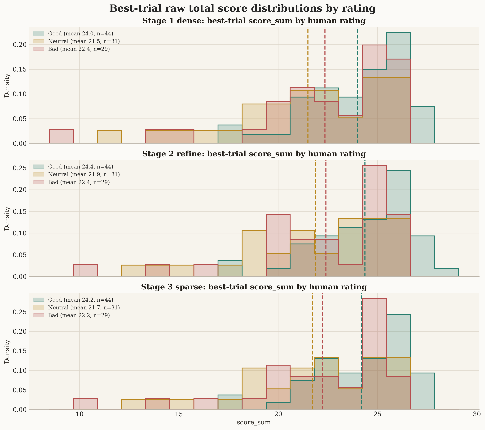
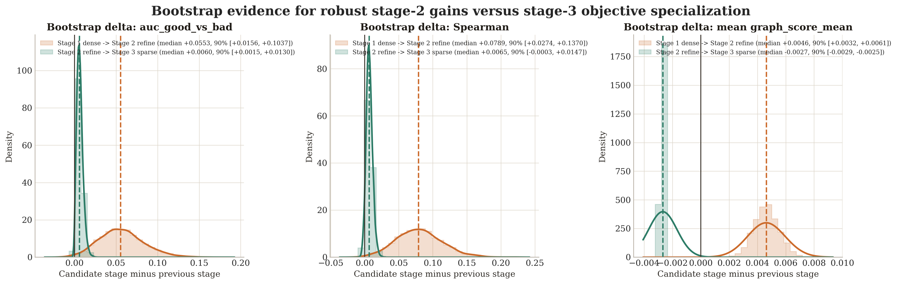
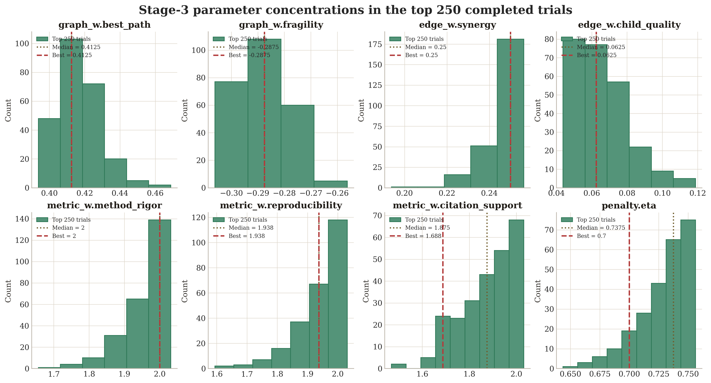

# Factorized resampling experiments

This folder contains **offline** experiment drivers that compute graph scores for
each paper in the collection, using a *factorized* resampling plan:

1. **Systematic paper collection** (Excel workbook)
2. **DAG extraction & validation** — resample **K** independent DAGs per paper
3. **Node scoring** — for each DAG, resample **M** node-scoring passes
4. **Graph scoring** — compute a score for each of the **K×M** trials

The intended primary entrypoints:

- `experiments/download_pdfs_from_collection.py` — mass download PDFs into a local folder structure.
- `experiments/factorized_collection_cli.py` — run the factorized scoring experiment over the collection.

## Minimal runtime file set

If your goal is *only* to run batch scoring experiments (no web UI), the minimal
runtime-relevant code paths are:

### Required

- `graph_app/kg_realtime_scoring.py` — DAG validation + KGScorer (graph score)
- `backend/prompts.py` — LLM prompts + JSON parsing/repair helpers
- `backend/llm_client.py` — offline LLM adapter (no UI protocol output)
- `backend/paper_io.py` — PDF text extraction helpers
- `backend/factorized_experiment.py` — factorized resampling driver
- `experiments/paper_collection.py` — spreadsheet reader
- `experiments/plotting.py` — KDE plotting helper
- `experiments/factorized_collection_cli.py` — main CLI
- `experiments/download_pdfs_from_collection.py` — optional downloader

### Not required for offline batch scoring

- `frontend/` (React app)
- `backend/server.py` (Flask server)
- `backend/main.py` (interactive demo w/ streaming)
- `experiments/batch_cli.py` (legacy; kept for compatibility)

## Typical workflow

0) Configure an LLM provider key (required to generate new cached runs):

```bash
# choose one
export OPENAI_API_KEY=...
# or
export BROWSER_USE_API_KEY=...
```

1) Download PDFs:

```bash
python -m experiments.download_pdfs_from_collection \
  --collection-xlsx "Paper collection.xlsx" \
  --pdf-root "data/pdfs" \
  --sheets all
```

2) Run factorized scoring:

```bash
python -m experiments.factorized_collection_cli \
  --collection-xlsx "Paper collection.xlsx" \
  --pdf-root "data/pdfs" \
  --out-root "runs/factorized_001" \
  --k-dags 5 \
  --m-node 3 \
  --max-nodes 12
```

Small smoke run (recommended first to build cache quickly):

```bash
python -m experiments.factorized_collection_cli \
  --collection-xlsx "Paper collection.xlsx" \
  --pdf-root "data/pdfs" \
  --out-root "runs/factorized_smoke" \
  --k-dags 2 \
  --m-node 2 \
  --max-nodes 10
```

Outputs:

- `runs/factorized_001/papers_summary.csv` — one row per paper (status + global score stats)
- Per-paper artifact folders with:
  - `extracted_text.txt`
  - `dag/dag_kXXX.json` + `dag/dag_kXXX_validation.json`
  - `node_scores/dag_kXXX/node_scores_mYYY.json`
  - `graph_scores.csv`
  - `summary.json`
  - `record.json`

## Offline ablation studies from cached runs

The ablation scripts run fully offline from cached factorized artifacts (no new
LLM calls):

```bash
python -m experiments.ablation_studies_cli \
  --runs-root runs/factorized_001 \
  --out-root runs/ablation_studies \
  --studyIDs 1,2,3,4,5,6 \
  --reuse-cache
```

Inspect available studies/variants:

```bash
python -m experiments.ablation_studies_cli --list-studies
```

## Hyperparameter tuning study (cache-first)

This repo uses a cache-first ablation study to tune scorer hyperparameters
without making new LLM calls. We run studies over cached factorized outputs and
compare variants using `study_variant_summary.csv` for each study.

Tuning command used:

```bash
python -m experiments.ablation_studies_cli \
  --runs-root runs/factorized_collection \
  --out-root runs/ablation_studies \
  --studyIDs 3,4,5 \
  --reuse-cache \
  --verbose
```

Study coverage:

- Study 3 (`edge_feature_ablation`): edge feature weights and priors
- Study 4 (`propagation_ablation`): trust propagation settings (`agg`, `alpha`, `eta`)
- Study 5 (`graph_component_ablation`): graph-head component weights

Selected default settings (kept in code after tuning):

- `EdgeCombineWeights` in `graph_app/kg_realtime_scoring.py`:
  `role_prior=0.30`, `parent_quality=0.20`, `child_quality=0.20`,
  `alignment=0.10`, `synergy=0.20`
- `PropagationPenalty`:
  `enabled=True`, `agg="min"`, `alpha=1.0`, `eta=2**(-1/8)`,
  `softmin_beta=6.0`, `dampmin_lambda=0.35`
- `GraphScoreWeights`:
  `bridge_coverage=0.25`, `best_path=0.25`, `redundancy=0.15`,
  `fragility=-0.15`, `coherence=0.10`, `coverage=0.10`

Outputs to inspect:

- `runs/ablation_studies/study_03_edge_feature_ablation/study_variant_summary.csv`
- `runs/ablation_studies/study_04_propagation_ablation/study_variant_summary.csv`
- `runs/ablation_studies/study_05_graph_component_ablation/study_variant_summary.csv`

## Exhaustive numeric grid search from cache

For true combinatorial searches over numeric scorer settings, use the dedicated
grid-search CLI. This stays fully offline and reuses cached `dag/*.json` and
`node_scores/*.json` artifacts.

Supported override key patterns:

- `metric_w.<metric>`: global node metric weights
- `node_q.<Role>.<metric>`: role-specific node quality weights
- `edge_w.<feature>`: edge combine weights
- `graph_w.<component>`: graph score weights
- `penalty.<field>`: propagation / trust-gating parameters

Example search-space JSON:

```json
{
  "name": "edge_weight_grid",
  "normalize_metric_weights": false,
  "params": {
    "edge_w.role_prior": [0.1, 0.2, 0.3],
    "edge_w.parent_quality": [0.1, 0.2, 0.3],
    "edge_w.child_quality": [0.1, 0.2, 0.3],
    "edge_w.alignment": [0.0, 0.1],
    "edge_w.synergy": [0.1, 0.2, 0.3]
  },
  "constraints": [
    {
      "type": "sum_lte",
      "params": [
        "edge_w.role_prior",
        "edge_w.parent_quality",
        "edge_w.child_quality",
        "edge_w.alignment",
        "edge_w.synergy"
      ],
      "value": 1.0
    }
  ]
}
```

Run it:

```bash
python -m experiments.grid_search_cli \
  --runs-root runs/experiments_debug4 \
  --out-root runs/grid_search \
  --search-space experiments/search_spaces/weight_grid_smoke.json \
  --max-workers 8 \
  --reuse-cache \
  --verbose
```

Key outputs:

- `config_index.csv`: every accepted configuration after constraints
- `per_paper_summary.csv`: one row per `(paper, config)`
- `config_summary.csv`: aggregated ranking metrics per configuration
- `top_configs.json`: best configurations by AUC and Spearman

Parallelism:

- The runner parallelizes over papers using worker processes.
- Each worker loads that paper's cached trials once, then scores all accepted
  configurations locally to reduce JSON reload overhead.

## Optuna search from cache

For dense search over numeric settings without enumerating every combination,
use the Optuna tuner. It samples from a defined search space and evaluates each
trial fully offline against cached `dag/*.json` and `node_scores/*.json`.

Install dependency in the experiment environment first:

```bash
.venv-exp/bin/pip install optuna
```

Search-space JSON uses Optuna-style parameter distributions:

```json
{
  "name": "optuna_edge_graph_search",
  "objective_metric": "auc_good_vs_bad",
  "direction": "maximize",
  "sampler": {
    "type": "tpe",
    "seed": 0,
    "n_startup_trials": 20,
    "multivariate": true
  },
  "pruner": {
    "type": "median",
    "n_startup_trials": 10,
    "n_warmup_steps": 5
  },
  "params": {
    "edge_w.role_prior": { "type": "float", "low": 0.0, "high": 0.4, "step": 0.05 },
    "edge_w.parent_quality": { "type": "float", "low": 0.0, "high": 0.4, "step": 0.05 },
    "edge_w.child_quality": { "type": "float", "low": 0.0, "high": 0.4, "step": 0.05 },
    "edge_w.alignment": { "type": "float", "low": 0.0, "high": 0.3, "step": 0.05 },
    "edge_w.synergy": { "type": "float", "low": 0.0, "high": 0.4, "step": 0.05 },
    "graph_w.best_path": { "type": "float", "low": 0.0, "high": 0.5, "step": 0.05 },
    "graph_w.bridge_coverage": { "type": "float", "low": 0.0, "high": 0.5, "step": 0.05 },
    "penalty.alpha": { "type": "float", "low": 0.25, "high": 2.0, "step": 0.25 },
    "penalty.eta": { "type": "float", "low": 0.5, "high": 1.0, "step": 0.05 }
  },
  "constraints": [
    {
      "type": "sum_lte",
      "params": [
        "edge_w.role_prior",
        "edge_w.parent_quality",
        "edge_w.child_quality",
        "edge_w.alignment",
        "edge_w.synergy"
      ],
      "value": 1.0
    }
  ]
}
```

Run it:

```bash
.venv-exp/bin/python -m experiments.optuna_search_cli \
  --runs-root runs/experiments_debug4 \
  --out-root runs/optuna_search \
  --search-space experiments/search_spaces/optuna_debug4_dense_v1.json \
  --n-trials 50 \
  --n-jobs 4 \
  --verbose
```

Key outputs:

- `optuna_study.sqlite3`: persistent Optuna study storage
- `trials.csv`: one row per trial with params and aggregate metrics
- `best_trial.json`: best completed trial
- `top_trials.json`: top completed trials
- `top_trial_per_paper/*.csv`: per-paper summaries for top saved trials

For longer studies, prefer multiple single-job workers sharing one SQLite
storage URL over a single process with large `--n-jobs`. The staged runs below
were executed as 4 concurrent workers with `--n-jobs 1` and `1024` trials per
worker.

## Multi-stage Optuna results

Three consecutive searches were run over the cached `runs/experiments_debug4`
dataset:

| Stage | Search space | Best AUC | Complete / Pruned | Best trial |
| --- | --- | ---: | ---: | ---: |
| Stage 1 dense | [optuna_debug4_dense_v1.json](search_spaces/optuna_debug4_dense_v1.json) | `0.702486` | `1147 / 2949` | `3457` |
| Stage 2 refine | [optuna_debug4_refine_v1.json](search_spaces/optuna_debug4_refine_v1.json) | `0.759423` | `2573 / 1523` | `3950` |
| Stage 3 sparse | [optuna_debug4_stage3_sparse_v1.json](search_spaces/optuna_debug4_stage3_sparse_v1.json) | `0.765838` | `3429 / 667` | `1011` |

Machine-readable summary:

- [../docs/img/optuna_stage_summary.json](../docs/img/optuna_stage_summary.json)

Raw local study artifacts referenced by that summary are intentionally left under
`runs/optuna_search_live`, `runs/optuna_search_refine`, and
`runs/optuna_search_stage3` rather than committed to git.

Headline deltas:

- Dense -> refine: `+0.056937` AUC, while prune rate dropped from `72.0%` to `37.2%`.
- Refine -> stage 3 sparse: `+0.006415` AUC, while prune rate dropped from `37.2%` to `16.3%`.
- Dense -> stage 3 sparse: `+0.063352` AUC overall.

Objective-metric note:

- `auc_good_vs_bad` and `spearman_good_neutral_bad` are computed on the `103` papers whose labels are exactly `Good`, `Neutral`, or `Bad`.
- The paper-facing score histogram below folds the single `Good (theory)` paper into `Good` for readability, so that figure is intentionally broader than the optimization metric.

Objective distributions by stage:



Paper-ready versions: [PDF](../docs/img/optuna_stage_objective_histograms.pdf) | [SVG](../docs/img/optuna_stage_objective_histograms.svg)

Best-so-far improvement across the three searches:


Paper-ready versions: [PDF](../docs/img/optuna_stage_best_so_far.pdf) | [SVG](../docs/img/optuna_stage_best_so_far.svg)

Raw per-paper total scores for each stage's best trial, split by paper label
(`Good (theory)` is folded into `Good`):



Paper-ready versions: [PDF](../docs/img/optuna_stage_score_sum_by_rating.pdf) | [SVG](../docs/img/optuna_stage_score_sum_by_rating.svg)

`score_sum` is the raw total score accumulated across a paper's cached trial
rows for a given configuration. It complements `graph_score_mean`: the mean is
the normalized ranking metric used in summaries, while `score_sum` makes the
absolute separation between `Good`, `Neutral`, and `Bad` papers easier to see.

Bootstrap evidence for stage-level behavior:



Paper-ready versions: [PDF](../docs/img/optuna_stage_bootstrap_deltas.pdf) | [SVG](../docs/img/optuna_stage_bootstrap_deltas.svg)

Stage-3 concentration of the surviving live parameters in the top `250`
completed trials:



Paper-ready versions: [PDF](../docs/img/optuna_stage3_key_param_histograms.pdf) | [SVG](../docs/img/optuna_stage3_key_param_histograms.svg)

Best-trial diagnostics:

| Stage | AUC | Spearman | Mean `graph_score_mean` | Grouped Good-Bad gap | Grouped Good-Neutral gap |
| --- | ---: | ---: | ---: | ---: | ---: |
| Stage 1 dense | `0.702486` | `0.313336` | `0.364914` | `0.027922` | `0.039563` |
| Stage 2 refine | `0.759423` | `0.394516` | `0.369567` | `0.033008` | `0.039175` |
| Stage 3 sparse | `0.765838` | `0.401420` | `0.366885` | `0.032914` | `0.038569` |

Bootstrap comparison of successive stages (`5000` paper-level resamples):

| Comparison | AUC delta | Spearman delta | Mean `graph_score_mean` delta |
| --- | --- | --- | --- |
| Dense -> refine | `+0.0566` median, `90% [+0.0156, +0.1037]`, `P(>0)=0.9888` | `+0.0789` median, `90% [+0.0274, +0.1370]`, `P(>0)=0.9968` | `+0.0046` median, `90% [+0.0032, +0.0061]`, `P(>0)=1.0000` |
| Refine -> stage 3 sparse | `+0.0060` median, `90% [+0.0015, +0.0130]`, `P(>0)=0.9870` | `+0.0065` median, `90% [-0.0003, +0.0147]`, `P(>0)=0.9404` | `-0.0027` median, `90% [-0.0029, -0.0025]`, `P(>0)=0.0000` |

Interpretation:

- Stage 2 behaves like a real improvement pass rather than a narrow benchmark fit: it improves the tuned AUC, the ordinal label correlation, and the mean paper score at the same time, and the bootstrap intervals stay safely above zero across all three metrics.
- Stage 3 behaves differently. It still squeezes out a small AUC gain on the exact tuned objective, but the Spearman gain is marginal and the mean paper score drops in every bootstrap replicate.
- The grouped class gaps also stop improving in stage 3: the grouped Good-Bad gap slips from `0.033008` to `0.032914`, and the grouped Good-Neutral gap slips from `0.039175` to `0.038569`.
- Taken together, this is evidence of objective overfitting in stage 3 on the fixed benchmark: it improves the exact optimization target without improving the broader score profile. Stage 2 does not show that failure mode and is the safer general refinement.

What mattered:

- The graph head collapsed to a sparse `best_path + fragility` form. By stage 3, `graph_w.bridge_coverage`, `graph_w.redundancy`, `graph_w.coherence`, and `graph_w.coverage` were frozen to `0.0`, while `graph_w.best_path` stayed around `0.41-0.45` and `graph_w.fragility` around `-0.30..-0.275`.
- `metric_w.credibility` and `metric_w.relevance` kept falling to the floor, so stage 3 fixed both at `0.25`.
- `metric_w.method_rigor`, `metric_w.reproducibility`, and `metric_w.citation_support` consistently stayed high. `metric_w.evidence_strength` remained important, but settled into a narrower mid-high band instead of saturating at the max.
- The edge model simplified materially: `edge_w.role_prior` went to `0`, `edge_w.alignment` stayed near `0`, `edge_w.parent_quality` and `edge_w.child_quality` stayed small, and `edge_w.synergy` pushed to the top of its refined range.
- `penalty.agg = mean` became the most stable winner in the refined searches, with `penalty.eta` around `0.70` and mid-range `penalty.alpha`.

Best stage-3 sparse configuration:

- Reusable fixed replay config: [optuna_debug4_stage3_best_v1.json](search_spaces/optuna_debug4_stage3_best_v1.json)

Key stage-3 best settings:

- `metric_w.evidence_strength = 1.0625`
- `metric_w.method_rigor = 2.0`
- `metric_w.reproducibility = 1.9375`
- `metric_w.citation_support = 1.6875`
- `edge_w.parent_quality = 0.025`
- `edge_w.child_quality = 0.0625`
- `edge_w.alignment = 0.0`
- `edge_w.synergy = 0.25`
- `penalty.agg = mean`
- `penalty.alpha = 0.75`
- `penalty.eta = 0.7`
- `graph_w.best_path = 0.4125`
- `graph_w.fragility = -0.2875`

Replay the fixed best configuration:

```bash
.venv-exp/bin/python -m experiments.optuna_search_cli \
  --runs-root runs/experiments_debug4 \
  --out-root runs/optuna_search_replay \
  --search-space experiments/search_spaces/optuna_debug4_stage3_best_v1.json \
  --n-trials 1 \
  --n-jobs 1 \
  --verbose
```

Regenerate the matplotlib report assets and machine-readable summary:

```bash
.venv-exp/bin/python experiments/generate_optuna_report_assets.py
```

Generated files:

- [../docs/img/optuna_stage_objective_histograms.png](../docs/img/optuna_stage_objective_histograms.png), [PDF](../docs/img/optuna_stage_objective_histograms.pdf), [SVG](../docs/img/optuna_stage_objective_histograms.svg)
- [../docs/img/optuna_stage_best_so_far.png](../docs/img/optuna_stage_best_so_far.png), [PDF](../docs/img/optuna_stage_best_so_far.pdf), [SVG](../docs/img/optuna_stage_best_so_far.svg)
- [../docs/img/optuna_stage_score_sum_by_rating.png](../docs/img/optuna_stage_score_sum_by_rating.png), [PDF](../docs/img/optuna_stage_score_sum_by_rating.pdf), [SVG](../docs/img/optuna_stage_score_sum_by_rating.svg)
- [../docs/img/optuna_stage_bootstrap_deltas.png](../docs/img/optuna_stage_bootstrap_deltas.png), [PDF](../docs/img/optuna_stage_bootstrap_deltas.pdf), [SVG](../docs/img/optuna_stage_bootstrap_deltas.svg)
- [../docs/img/optuna_stage3_key_param_histograms.png](../docs/img/optuna_stage3_key_param_histograms.png), [PDF](../docs/img/optuna_stage3_key_param_histograms.pdf), [SVG](../docs/img/optuna_stage3_key_param_histograms.svg)
- [../docs/img/optuna_stage_summary.json](../docs/img/optuna_stage_summary.json)
